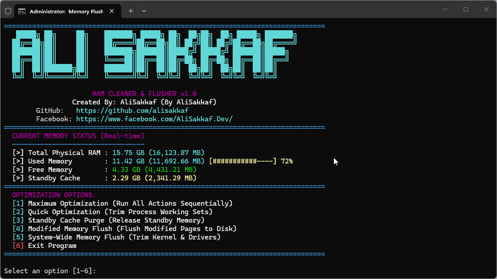
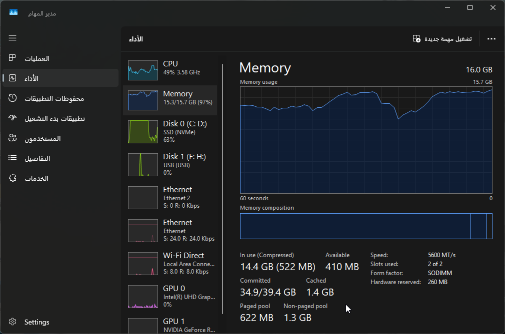
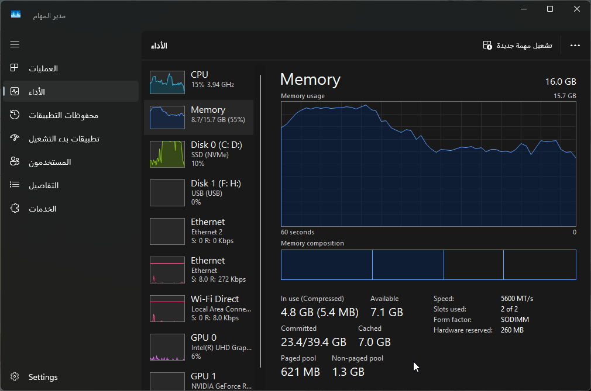
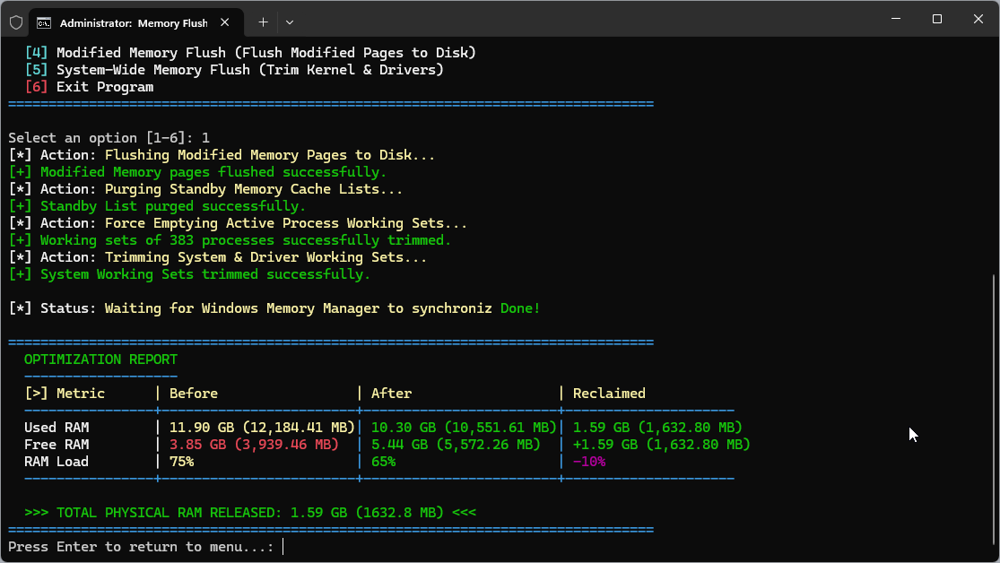

> [!IMPORTANT]
> **🚀 Looking for the Ultimate Windows 11 Desktop GUI Application [EXE] with 40% - 60% Memory Reclamation And More?**  
> Upgrade to **[RAM Cleaner & Flusher Pro Suite](https://github.com/alisakkaf/RAM-Cleaner-Flusher-Pro)** — an enterprise-grade native Win32 C++ desktop application featuring **Windows 11 Fluent 2.0 Dark & Light themes**, **Svchost Windows Service name resolution**, **App Launch Game & Software Booster**, **Process Inspector & Group Diagnostics**, **Automated Background Threshold Rules**, **System Tray Mode**, **Silent Auto-Updater**, and **100% Full Compatibility across Windows 7, 8, 10, 11 (21H2-26H1) & Windows Server**!
>
> <p align="left">
>   <a href="https://github.com/alisakkaf/RAM-Cleaner-Flusher-Pro">
>     
>   </a>
>   &nbsp;&nbsp;
> </p>

---

# 🚀 RAM Cleaner & Flusher (CLI & App Booster Suite)

A professional, enterprise-grade, high-performance, and lightweight memory optimization utility for Windows. Unlike generic memory cleaners that consume system resources or rely on slow and cached WMI metrics, this tool directly P/Invokes native Windows Win32 APIs (**`GlobalMemoryStatusEx`**, **`NtSetSystemInformation`**, and **`EmptyWorkingSet`**) to safely, accurately, and instantaneously reclaim standby, modified, and working set memory.

Developed by **AliSakkaf**. Connect with me on [GitHub](https://github.com/alisakkaf) and [Facebook](https://www.facebook.com/AliSakkaf.Dev/).

---

## 📌 What's New in Version 1.1 

* **🎮 Expanded 9-Option Interactive Menu**: New interactive console dashboard featuring direct choices for App Launch Booster (Option 6), Exclusion Protection Manager (Option 7), Auto Memory Threshold Check (Option 8), and Exit (Option 9).
* **🚀 App Launch Game & Software Booster**: Pre-purges system RAM and launches any target application with **`HIGH_PRIORITY_CLASS`** priority to eliminate micro-stutters in open-world games and heavy IDEs.
* **🛡️ Exclusion Protection Manager**: Interactive and CLI protection engine allowing users to add process names (`chrome`, `devenv`, `vlc.exe`) to prevent working set trimming routines from touching active programs.
* **⚡ Auto RAM Threshold Check**: Configure trigger thresholds (e.g. 80%). The script checks real-time RAM load and automatically executes Maximum Optimization if memory load exceeds the threshold limit.
* **🔒 UTF-8 BOM Parser Security**: Encoded strictly in UTF-8 with BOM (`utf-8-sig`) to guarantee Windows PowerShell 5.1 parses ASCII banner blocks, ampersands (`&`), and multi-stop strings without ANSI codepage corruption across all global Windows locales.
* **🤖 Non-Interactive Headless CLI Modes**: Full support for background task scheduling via `-Mode`, `-Silent`, `-AutoThreshold`, `-ExcludeProcess`, and `-BoostApp` parameters.

---

## 📸 Screenshots & Visual Interface

### 🖥️ 1. Main Menu & Real-Time Dashboard
The utility starts with a premium console interface displaying a custom ASCII art banner, real-time physical memory status, active protected exclusions, and a color-coded memory utilization bar.


### 📈 2. Memory State Before Cleaning (High Load)
Visual snapshot of the system under high memory load (heavy consumption of used memory and standby cache).


### 📉 3. Memory State After Cleaning (Low Load)
Visual snapshot of the dashboard showing memory load reduction, increased free memory, and cleared standby cache.


### 📊 4. Comparative Optimization Report
Every optimization run outputs a detailed comparative table showing the exact changes in Used RAM, Free RAM, and RAM Load (%), alongside the total physical memory released in both **Gigabytes (GB) and Megabytes (MB)**.


---

## 🌟 Comprehensive Features

* **Direct Win32 P/Invoke Declarations**: Bypasses the overhead of standard PowerShell cmdlets by loading and compiling native DLL entry points (`ntdll.dll`, `kernel32.dll`, `psapi.dll`, and `advapi32.dll`) directly into the session.
* **Instantaneous Memory Metrics**: Utilizes the native C++ `GlobalMemoryStatusEx` API to obtain an un-cached snapshot of physical memory, bypassing WMI lag to show immediate and accurate results.
* **Process Working Set Trimming**: Loops through active process handles and calls `EmptyWorkingSet` (or fallback to `SetProcessWorkingSetSize` with `-1, -1`) to release unused process pages back to the operating system.
* **Standby List Purge**: Reclaims standby cache memory system-wide by calling `NtSetSystemInformation` with Class `80` (SystemMemoryListInformation) and command `4` (MemoryPurgeStandbyList).
* **Modified Page List Flush**: Commits modified pages to pagefiles or disk storage by calling `NtSetSystemInformation` with command `3` (MemoryFlushModifiedList), turning dirty pages into standby/free memory.
* **System Working Set Flush**: Trims kernel-level working sets by calling `NtSetSystemInformation` with command `2` (MemoryEmptyWorkingSets).
* **Maximum Optimization Mode**: Executes all flushing and trimming operations sequentially, accompanied by a 1.5-second stabilization delay (`Start-SyncDelay`) to let the Windows memory manager synchronize.
* **UTF-8 BOM Parser Encoding**: Encoded strictly in UTF-8 with BOM to prevent Windows-1252 ANSI encoding parsing errors, protecting Unicode block characters and avoiding ampersand/quote crashes on non-English locales.
* **Self-Elevating Execution**: Detects administrative privileges upon execution and prompts to restart automatically with Administrator permissions to enable diagnostic memory rights.

---

## 📖 Interactive Menu Options (1 - 9)

```
  OPTIMIZATION & FEATURE OPTIONS:
  [1] Maximum Optimization (Run All Actions Sequentially)
  [2] Quick Optimization (Trim Process Working Sets)
  [3] Standby Cache Purge (Release Standby Memory)
  [4] Modified Memory Flush (Flush Modified Pages to Disk)
  [5] System-Wide Memory Flush (Trim Kernel & Drivers)
  [6] App Launch Booster (Pre-Purge RAM & Launch App with HIGH Priority)
  [7] Exclusion Protection Manager (Manage Protected Applications)
  [8] Auto Memory Threshold Check (Run Optimization if RAM > Threshold %)
  [9] Exit Program
```

---

## 💻 Command-Line Interface (CLI) & Automation Guide

Version 1.1 includes full CLI support for Task Scheduler, game launchers, and automated scripts:

### 1. Execute Maximum Optimization Silently
```powershell
powershell -ExecutionPolicy Bypass -File .\RAM_Flusher.ps1 -Mode Max -Silent
```

### 2. Auto-Clean Only When RAM Load Exceeds 80%
```powershell
powershell -ExecutionPolicy Bypass -File .\RAM_Flusher.ps1 -Mode Max -AutoThreshold 80 -Silent
```

### 3. Exclude Critical IDEs & Web Browsers from Trimming
```powershell
powershell -ExecutionPolicy Bypass -File .\RAM_Flusher.ps1 -Mode Max -ExcludeProcess "chrome","devenv","idea64"
```

### 4. App Launch Booster (Pre-Purge RAM & Launch with High Priority)
```powershell
powershell -ExecutionPolicy Bypass -File .\RAM_Flusher.ps1 -BoostApp "C:\Games\Cyberpunk2077\bin\x64\Cyberpunk2077.exe"
```

---

## ⚙️ Technical Deep Dive: Windows Memory Architecture

To understand how this tool operates, it is important to know the different memory lists managed by the Windows Kernel:

### 1. Working Sets
The working set of a process is the set of memory pages in the physical RAM currently page-mapped to that process's virtual address space. Over time, processes allocate memory that they no longer actively use. Trimming the working set forces Windows to reclaim these inactive pages and move them to the Standby list.

### 2. Standby Memory List
The Standby list is a cache of physical memory pages containing data/code that has been removed from process working sets but remains in RAM. If a process requests this data again, Windows resolves a "soft page fault" and maps it back instantly. However, if physical memory runs low, Windows moves these pages to the Free list. Purging this list releases these pages immediately.

### 3. Modified Memory List
The Modified list contains memory pages that have been modified by processes but have not yet been written to disk (pagefile). These pages cannot be reused for other purposes until they are committed. Flushing this list forces the modified writer thread to write them to disk, converting them to Standby or Free pages.

---

## 🛠️ P/Invoke API Signatures Used

The script compiles a low-level C# class inside the PowerShell engine:

### 1. Retrieve Precise RAM Snapshots
```csharp
[StructLayout(LayoutKind.Sequential, CharSet = CharSet.Auto)]
public struct MEMORYSTATUSEX {
    public uint dwLength;
    public uint dwMemoryLoad;
    public ulong ullTotalPhys;
    public ulong ullAvailPhys;
    public ulong ullTotalPageFile;
    public ulong ullAvailPageFile;
    public ulong ullTotalVirtual;
    public ulong ullAvailVirtual;
    public ulong ullAvailExtendedVirtual;
}

[DllImport("kernel32.dll", SetLastError = true)]
public static extern bool GlobalMemoryStatusEx(ref MEMORYSTATUSEX lpBuffer);
```

### 2. Memory Purges via Windows NT Kernel API
```csharp
[DllImport("ntdll.dll", SetLastError = true)]
public static extern uint NtSetSystemInformation(
    int SystemInformationClass,
    IntPtr SystemInformation,
    int SystemInformationLength
);
```

---

## 💻 Compatibility Matrix

| Operating System | Edition | Architecture | PowerShell | Status |
| :--- | :--- | :--- | :--- | :--- |
| **Windows 11** | Home, Pro, Enterprise | x64, ARM64 | v5.1, v7.x | **Fully Supported** |
| **Windows 10** | Home, Pro, Enterprise | x86, x64 | v5.1, v7.x | **Fully Supported** |
| **Windows 8 / 8.1**| Pro, Enterprise | x86, x64 | v3.0, v4.0 | **Fully Supported** |
| **Windows 7 SP1** | Home, Pro, Ultimate | x86, x64 | v2.0, v3.0 | **Fully Supported** |
| **Windows Server** | 2008 R2, 2012, 2016, 2019, 2022, 2025 | x64 | v2.0 - v5.1 | **Fully Supported** |

---

## 🔒 Security & Admin Rights

This tool interacts directly with native kernel routines. Therefore, it requires **Administrative privileges** to modify local security token privileges:
* **`SeProfileSingleProcessPrivilege`**: Required to call `NtSetSystemInformation` for purging standby lists.
* **`SeIncreaseQuotaPrivilege`**: Required to call `SetProcessWorkingSetSize` for processes owned by other users or services.

> [!IMPORTANT]
> The source code contains **no internet connections, trackers, or hidden telemetries**. It is 100% auditable and safe to use in restricted corporate environments.

---

## 🚀 How to Run the Tool

### Method 1: The Batch Launcher (Recommended)
1. Navigate to the extracted folder.
2. Double-click **`Ultra_RAM_Cleaner.bat`**.
3. Accept the UAC administrator prompt. The launcher automatically bypasses execution restrictions and loads the script.

### Method 2: Manual Execution in PowerShell
1. Open PowerShell as **Administrator**.
2. Run the following commands:
   ```powershell
   Set-ExecutionPolicy Bypass -Scope Process -Force
   cd "C:\Path\To\RAM_Cleaner_Flusher"
   .\RAM_Flusher.ps1
   ```

---

## 📄 License
Licensed under the **MIT License**. See the [LICENSE](LICENSE) file for copyright disclosures.

---

### 💡 Support the Developer

<div align="center">
  <i>If you find my tools and projects useful, consider supporting my work. Your support helps keep these projects completely free!</i>
</div>

<br>

<div align="center">

| Crypto Asset | Network | Wallet Address (Copy) | Quick Scan |
| :--- | :--- | :--- | :---: |
|  | **TRC20** | `TYLBeDA5aGNcc3WkVqf3xWPHXmsZzs2p28` | <a href="https://api.qrserver.com/v1/create-qr-code/?size=300x300&margin=10&data=TYLBeDA5aGNcc3WkVqf3xWPHXmsZzs2p28" target="_blank"></a> |
|  | **BEP20** | `0x67cf27f33c80479ea96372810f9e2ee4c3b095c5` | <a href="https://api.qrserver.com/v1/create-qr-code/?size=300x300&margin=10&data=0x67cf27f33c80479ea96372810f9e2ee4c3b095c5" target="_blank"></a> |
|  | **Bitcoin** | `bc1q97dr37h37npzarmmrv0tjz2nm50htqc7pfpzj6` | <a href="https://api.qrserver.com/v1/create-qr-code/?size=300x300&margin=10&data=bitcoin:bc1q97dr37h37npzarmmrv0tjz2nm50htqc7pfpzj6" target="_blank"></a> |
|  | **ERC20** | `0x67cf27f33c80479ea96372810F9e2EE4C3b095C5` | <a href="https://api.qrserver.com/v1/create-qr-code/?size=300x300&margin=10&data=ethereum:0x67cf27f33c80479ea96372810F9e2EE4C3b095C5" target="_blank"></a> |
|  | **Solana** | `Cbesgr4tvo4T1inNMFe46GSym2qMYjkmofbXFc77rDNK` | <a href="https://api.qrserver.com/v1/create-qr-code/?size=300x300&margin=10&data=solana:Cbesgr4tvo4T1inNMFe46GSym2qMYjkmofbXFc77rDNK" target="_blank"></a> |
|  | **ERC20** | `0x67cf27f33c80479ea96372810f9e2ee4c3b095c5` | <a href="https://api.qrserver.com/v1/create-qr-code/?size=300x300&margin=10&data=0x67cf27f33c80479ea96372810f9e2ee4c3b095c5" target="_blank"></a> |
|  | **SPL** | `Cbesgr4tvo4T1inNMFe46GSym2qMYjkmofbXFc77rDNK` | <a href="https://api.qrserver.com/v1/create-qr-code/?size=300x300&margin=10&data=solana:Cbesgr4tvo4T1inNMFe46GSym2qMYjkmofbXFc77rDNK" target="_blank"></a> |
|  | **BEP20** | `0x67cf27f33c80479ea96372810F9e2EE4C3b095C5` | <a href="https://api.qrserver.com/v1/create-qr-code/?size=300x300&margin=10&data=0x67cf27f33c80479ea96372810F9e2EE4C3b095C5" target="_blank"></a> |

</div>

---

## 🤝 Contributing
For bug reports, feature requests, or translations, feel free to open a ticket on the GitHub Repository [issues page](https://github.com/alisakkaf/RAM-Cleaner-Flusher/issues).

*Created and maintained with ❤️ by **AliSakkaf**.*
